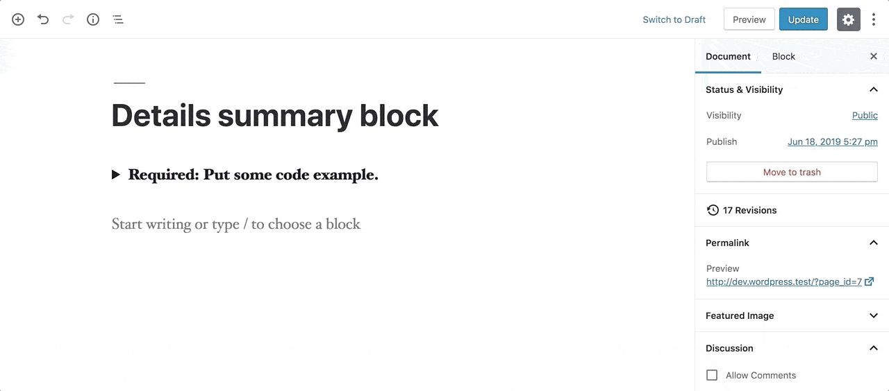

<h1 align="center">Welcome to details-summary-block 👋</h1>
<p>
  
  <a href="https://github.com/dingo-d/details-summary-block#readme">
    
  </a>
  <a href="https://github.com/dingo-d/details-summary-block/graphs/commit-activity">
    
  </a>
  <a href="https://github.com/dingo-d/details-summary-block/blob/master/LICENSE">
    
  </a>
  <a href="https://twitter.com/made_by_denis">
    
  </a>
</p>

> Simple details summary Gutenberg block

### 🏠 [Homepage](https://github.com/dingo-d/details-summary-block#readme)



## Install (using zip file)

The zip file can be downloaded [here](https://github.com/dingo-d/details-summary-block/releases/download/1.0.0/details-summary-block.zip). Just install it as a plugin and you're good to go.

## Install (manually)

Go to your plugin folder, clone the block and install necessary development dependencies

```sh
git clone git@github.com:dingo-d/details-summary-block.git
npm install
```

## Usage

To start developing, in your terminal, run

```sh
npm run start
```

## Build

To build the block, in your terminal, run

```sh
npm run build
```

Once built, `node_modules` part can be removed.

## Author

👤 **Denis Žoljom**

* Twitter: [@made_by_denis](https://twitter.com/made_by_denis)
* Github: [@dingo-d](https://github.com/dingo-d)

## 🤝 Contributing

Contributions, issues and feature requests are welcome!<br />Feel free to check [issues page](https://github.com/dingo-d/details-summary-block/issues).

## Show your support

Give a ⭐️ if this project helped you!

## 📝 License

Copyright © 2019 [Denis Žoljom](https://github.com/dingo-d).<br />
This project is [MIT](https://github.com/dingo-d/details-summary-block/blob/master/LICENSE) licensed.

***
_This README was generated with ❤️ by [readme-md-generator](https://github.com/kefranabg/readme-md-generator)_
